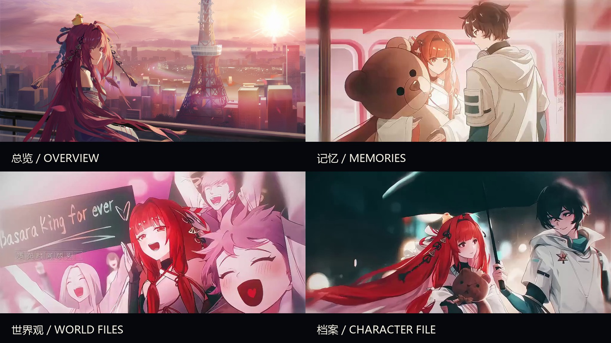

# Eriyi · Longzu Archive



一个以绘梨衣与《龙族》世界为主题的非官方二次元同人网页原型。页面将雨夜、列车、城市灯光和角色档案组织成一份可浏览的视觉记忆档案，适合作为静态网页展示、个人创作实验或前端视觉练习。

> 本项目为非官方同人主题站，不代表《龙族》版权方，也不用于商业用途。页面文字为主题化原创改写，不复制原作大段正文。

## 项目亮点

- **全屏叙事视觉**：使用四组独立背景组成总览、记忆、世界观和角色档案。
- **场景化导航**：顶部导航、右侧场景指示器和底部选择按钮可以在不同主题页面间切换。
- **渐进式文本叙事**：点击内容区域、滚轮、`Enter` 或 `Space` 推进当前场景的短句叙事。
- **CG 画廊**：支持全屏查看、缩略图、上一张/下一张、方向键切换和 `Escape` 关闭。
- **动态视觉层**：包含粒子、环境光、鼠标视差、背景渐变和轻量 Ken Burns 动画。
- **响应式布局**：针对桌面端和移动端保留不同的间距、字号与交互布局。
- **纯静态部署**：不依赖数据库、构建工具、外部字体服务或个人信息。

## 页面与场景

| 路由 | 场景 | 内容 |
| --- | --- | --- |
| `/` | 总览 | 绘梨衣主题主视觉与入口选择 |
| `/work` | 记忆 | 雨夜、列车、城市与未说完的话 |
| `/about` | 档案 | 安静、直接、温柔而明亮的角色印象 |
| `/404` | 迷失的记忆 | 找不到页面时的主题化返回入口 |
| CG 画廊 | 视觉档案 | 10 张龙族主题画面组成的全屏画廊 |

## 交互方式

- 点击顶部导航或底部选项：切换场景。
- 鼠标滚轮：浏览相邻场景。
- `Enter` / `Space`：推进当前场景叙事。
- `←` / `→`：在场景或 CG 画廊中切换内容。
- `Escape`：关闭 CG 画廊。
- 鼠标移动：触发背景和光效的轻微视差。
- 移动端：使用触摸、点击和响应式导航浏览页面。

## 项目预览

### 四个核心场景


### 原始场景素材

<table>
  <tr>
    <td></td>
    <td></td>
  </tr>
  <tr>
    <td align="center">总览 / Overview</td>
    <td align="center">记忆 / Memories</td>
  </tr>
  <tr>
    <td></td>
    <td></td>
  </tr>
  <tr>
    <td align="center">世界观 / World Files</td>
    <td align="center">档案 / Character File</td>
  </tr>
</table>

## 技术实现

- HTML5 静态页面
- CSS3 全屏布局、渐变、滤镜、响应式断点和动画
- 原生 JavaScript 场景状态管理、键盘/滚轮交互、Canvas 粒子与画廊控制
- Nginx Alpine 静态服务
- Docker 容器化本地预览
- 所有主题图片保存在 `images/dragon/`，不依赖外部 CDN

## 目录结构

```text
anime-site/
├── index.html
├── work.html
├── about.html
├── 404.html
├── site-visual-layer.css
├── site-visual-layer.js
├── screenshots/
│   └── scene-overview.jpg
├── images/dragon/
│   ├── longzu-main.jpg
│   ├── longzu-projects.jpg
│   ├── longzu-capabilities.jpg
│   ├── longzu-about.jpg
│   └── cg_01.jpg ... cg_10.jpg
├── Dockerfile
├── nginx/default.conf
└── README.md
```

## 本地预览

在 `anime-site/` 目录执行：

```bash
docker build -t eriyi-longzu-archive:local .
docker run --rm --name eriyi-longzu-archive -p 8081:80 eriyi-longzu-archive:local
```

然后打开：<http://localhost:8081/>

也可以使用任意静态文件服务器直接托管该目录。Nginx 配置支持 `/`、`/work`、`/about` 和 `/404` 路由。

## 素材与版权说明

本仓库仅用于非商业同人主题展示和前端视觉实验。`龙族`及相关角色名称、世界观和原始素材的权利归其相应权利人所有。本项目不代表官方，不提供商业授权，也不暗示与版权方存在合作关系。
